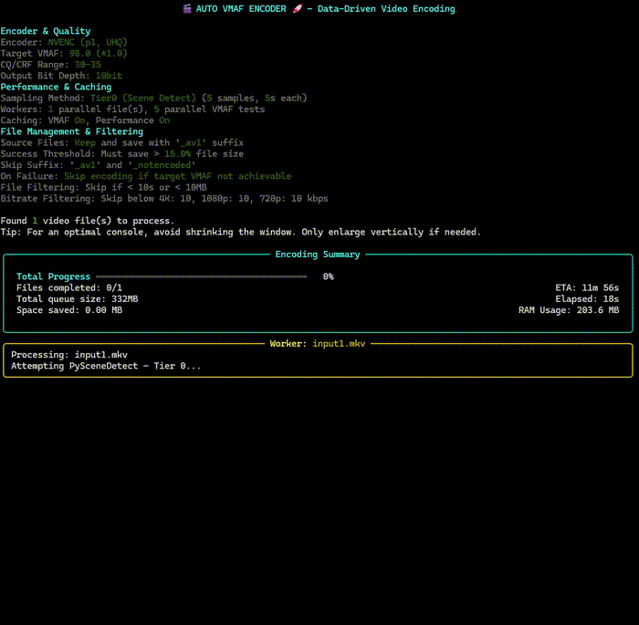

Auto-VMAF Encoder
An advanced Python script for video encoding that uses a data-driven approach to determine optimal encoding parameters. The script finds the perfect CQ/CRF (Constant Quality Factor / Constant Rate Factor) value to achieve a target video quality, as measured by a predefined VMAF (Video Multimethod Assessment Fusion) score.

!\[Python](https://img.shields.io/badge/python-v3.8+-blue.svg)

!\[License](https://img.shields.io/badge/license-MIT-green.svg)

!\[Platform](https://img.shields.io/badge/platform-Windows-blue.svg)

🖥️ Console Interface

  

Real-time encoding progress with multi-threaded workers and performance statistics
🎯 Key Features
Smart Encoding

Intelligent Sampling: Analyzes short video samples using multiple detection methods (PySceneDetect, keyframe analysis, or time intervals) to find key scenes and assess media complexity
VMAF-Targeted Quality: Uses binary search to find the optimal CQ/CRF value that achieves your target VMAF score with mathematical precision
Complexity-Aware Processing: Automatically adjusts encoding parameters based on video complexity analysis

Multi-Encoder Support

NVENC AV1: Hardware-accelerated encoding with configurable presets and quality modes
SVT-AV1: Software encoding with customizable presets and film grain settings
Color Space Preservation: Maintains HDR, color primaries, and transfer characteristics from source

Advanced Caching System

VMAF Cache: Stores VMAF comparison results to avoid re-testing identical samples
Performance Database: Learns from past encodes to provide accurate ETA predictions
Complexity-Aware Caching: Cache keys include video complexity scores for better accuracy

Real-Time Performance Monitoring

Live Progress UI: Beautiful console interface with real-time progress bars and statistics
Multi-Threading: Parallel processing of multiple files with configurable worker limits
Memory Management: Intelligent memory monitoring to prevent system crashes
Detailed Logging: Comprehensive encoding logs with performance metrics

Intelligent File Management

Configurable Filtering: Skip files based on duration, file size, or bitrate thresholds
Size Reduction Validation: Only keeps encoded files that achieve meaningful size reduction
Flexible Output Options: Configurable output directories and file naming schemes
Safe Processing: Optional source file deletion with comprehensive validation

Precision ETA Calculation

Machine Learning-Based Predictions: Uses historical performance data to predict encoding times
Complexity-Adjusted Estimates: Factors in video complexity for more accurate time predictions
Real-Time Updates: Dynamic ETA adjustment based on current performance ratios
Component-Based Analysis: Separate time tracking for sampling, VMAF testing, and final encoding

🎬 Demo
Complete encoding workflow from file detection to optimized output
🚀 Getting Started
Prerequisites

Python 3.8+ with pip
FFmpeg with VMAF support
Required Python packages:
bashpip install rich psutil

Optional for advanced scene detection (recommended):
bashpip install scenedetect\[opencv]

Installation

Download the script:

Download auto\_vmaf\_encoder.py from the releases
Or clone this repository

Install dependencies:
bashpip install -r requirements.txt

Configure the script:

Copy config.ini.example to config.ini
Edit the paths and settings according to your system
Required: Set paths to FFmpeg, FFprobe, and VMAF model

Run the encoder:
bashpython auto\_vmaf\_encoder.py

⚙️ Configuration

Example configuration with recommended settings
The script uses a comprehensive config.ini file for all settings:
Essential Settings
ini\[Paths]
ffmpeg\_path = /path/to/ffmpeg
ffprobe\_path = /path/to/ffprobe
vmaf\_model\_path = /path/to/vmaf\_v0.6.1.json

\[VMAF\_Targeting]
target\_vmaf = 95.0
vmaf\_tolerance = 1.0
cq\_search\_min = 15
cq\_search\_max = 35
Advanced Options

Encoder Selection: Choose between NVENC and SVT-AV1
Sampling Methods: Tier0 (scene detection), Tier1 (keyframes), or Tier2 (intervals)
Performance Tuning: Worker counts, memory limits, parallel VMAF runs
File Filtering: Duration, size, and bitrate thresholds
Output Control: Bit depth, color space handling, file management

📊 How It Works

File Discovery: Scans for video files while respecting filtering criteria
Complexity Analysis: Uses intelligent sampling to assess video complexity
Sample Creation: Extracts representative segments for VMAF testing
Binary Search: Iteratively tests CQ/CRF values to find the optimal setting
Final Encoding: Applies the discovered settings to encode the full video
Validation: Ensures meaningful size reduction before keeping the result

🎛️ Advanced Features
Tiered Sampling System

Tier 0: PySceneDetect for precise scene change detection
Tier 1: FFmpeg keyframe analysis for structural sampling
Tier 2: Time-based intervals as a reliable fallback

Performance Optimization

In-Memory Processing: VMAF comparisons using temporary files for speed
Parallel VMAF Testing: Multiple simultaneous quality tests
Intelligent Caching: Avoids redundant calculations across runs

Quality Assurance

Size Reduction Validation: Configurable minimum space savings threshold
Bitrate-Based Filtering: Skip files that are already efficiently encoded
Color Space Preservation: Maintains HDR and wide color gamut properties

📈 Performance

Example: 332MB video reduced to 181MB (45.6% savings) while maintaining VMAF 97.2
Typical performance improvements with caching enabled:

50-80% faster repeat processing of similar content
Accurate ETA predictions within 10-15% of actual time
Memory-efficient processing of large video files
Scalable from single-file to batch processing

🤝 Contributing
This project was created by someone with no prior coding experience, using AI assistance (Gemini Pro 2.5, Claude Sonnet, and Claude Opus 4) for advanced mathematics and coding implementation. The core ideas and extensive debugging/fine-tuning were done manually.
Contributions are welcome! Please feel free to:

Report bugs or suggest features
Submit pull requests
Improve documentation
Share your configuration optimizations

📄 Documentation

Complete User Manual - Comprehensive PDF guide with detailed setup instructions, configuration explanations, and troubleshooting

📝 License
This project is licensed under the MIT License - see the LICENSE file for details.
⚠️ Disclaimer

Backup your files: Always test with copies first
Hardware requirements: NVENC requires compatible NVIDIA GPUs
Processing time: Initial runs without cache can be time-intensive
VMAF accuracy: Results depend on the quality of your VMAF model

🙏 Acknowledgments

VMAF Team for the video quality assessment framework
FFmpeg Community for the powerful multimedia framework
AI Assistants (Gemini Pro 2.5, Claude Sonnet \& Opus 4) for coding assistance
Open Source Community for the excellent Python libraries used

Built with ❤️ and a lot of debugging
Star this repository if it helped you encode better videos! ⭐

